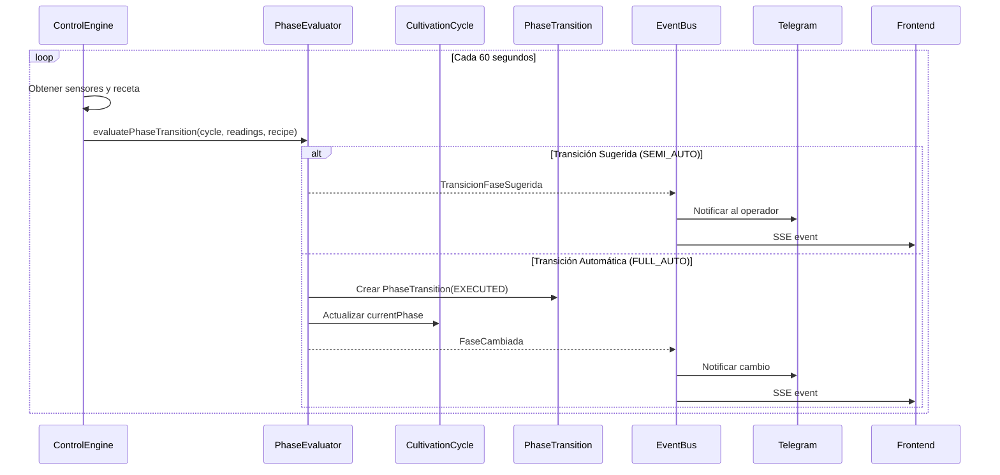

# DDD-001: Modelo de Dominio - Mush2 LabTech

---

## Metadatos

| Campo | Valor |
|-------|-------|
| **ID** | DDD-001 |
| **Nombre** | Modelo de Dominio Mush2 LabTech |
| **Fecha** | 2026-07-14 |
| **Versión** | 1.0 |
| **Estado** | Borrador |
| **Autor** | Equipo Mush2 |

---

## 1. Resumen Ejecutivo

Este documento define el **Modelo de Dominio** de Mush2 LabTech mediante los principios de Domain-Driven Design (DDD). Establece el **Lenguaje Ubicuo**, identifica los **Contextos Limitados**, define los **Agregados**, **Objetos de Valor**, **Eventos de Dominio** y **Máquinas de Estado** que conforman la arquitectura conceptual del sistema.

Mush2 es una plataforma IoT de cultivo micológico inteligente que combina hardware físico (cámaras biológicas con sensores y actuadores) con una aplicación web full-stack para monitoreo, control y asesoría con IA.

---

## 2. Lenguaje Ubicuo (Ubiquitous Language)

El Lenguaje Ubicuo es el corazón de DDD. Términos precisos que desarrolladores, expertos del negocio y usuarios comparten sin ambigüedad.

### 2.1 Dominio Principal: Cultivo Micológico

| Término | Definición | Ejemplo |
|---------|------------|---------|
| **Cultivo** | Ciclo completo de crecimiento de hongos en cámara controlada, desde inoculación hasta cosecha final | "El cultivo de Shiitake #12 duró 45 días" |
| **Cámara** | Recinto físico controlado donde se realizan los cultivos, equipado con sensores y actuadores | "Cámara A tiene 2m³ de volumen" |
| **Especie** | Variedad de hongo con características biológicas específicas que determinan los parámetros de cultivo | "Hericium erinaceus requiere alta humedad" |
| **Cepa (Strain)** | Variación genética dentro de una especie, puede afectar rendimiento y requisitos | "CEP-001 es una cepa resistente" |

### 2.2 Ciclo de Cultivo

| Término | Definición |
|---------|------------|
| **Fase** | Etapa del ciclo de cultivo con parámetros climáticos específicos. Fases: Incubación → Fructificación → Mantenimiento → Completado |
| **Incubación** | Fase inicial donde el micelio coloniza el sustrato. Alta humedad, temperatura estable, baja ventilación |
| **Fructificación** | Fase donde aparecen los cuerpos fructificantes (hongos). Requiere FAE (Fresh Air Exchange), luz, variación térmica |
| **Mantenimiento** | Fase de producción sostenida con flushes (cosechas parciales) recurrentes |
| **Flush** | Cosecha parcial de hongos dentro de un ciclo, separada por períodos de reposo |
| **Transición de Fase** | Cambio de una fase a otra, puede ser automática, semiautomática o manual |

### 2.3 Parámetros Climáticos

| Término | Definición | Unidad |
|---------|------------|--------|
| **Temperatura** | Grado calórico del aire en la cámara | °C |
| **Humedad** | Porcentaje de saturación de vapor de agua en el aire | %RH |
| **CO₂** | Dióxido de carbono, indicador de actividad metabólica y necesidad de ventilación | ppm |
| **VOC** | Compuestos Orgánicos Volátiles, indicador de calidad de aire | ppb |
| **VPD** | Déficit de Presión de Vapor, indicador compuesto de estrés hídrico | kPa |
| **SetPoint** | Rango de valores ideales (mínimo y máximo) para un parámetro en una fase específica | — |
| **Umbral** | Límite que al ser superado genera una alarma | — |
| **Histéresis** | Margen de tolerancia para evitar oscilaciones en el control de actuadores | ±1.0°C |

### 2.4 Hardware

| Término | Definición |
|---------|------------|
| **Dispositivo (Device)** | Controlador IoT ESP32-S3 que gestiona sensores y actuadores de una cámara |
| **Sensor** | Dispositivo de medición (Temperatura, Humedad, CO₂, VOC). Puede estar en estado ACTIVE, INACTIVE o FAULT |
| **Actuador (SSR)** | Solid State Relay que controla equipmento: ventilador, calefactor, humidificador, luz |
| **Canal** | Canal de salida del actuador (0-3), cada uno controla un equipo diferente |
| **Modo Local/Remote** | Si el actuador responde a comandos del motor de control (REMOTE) o a operación manual (LOCAL) |

### 2.5 Control y Automatización

| Término | Definición |
|---------|------------|
| **Motor de Control (ControlEngine)** | Sistema que evalúa el estado del cultivo cada 60 segundos y genera comandos para actuadores |
| **Regla de Transición** | Condición que determina cuándo un cultivo debe cambiar de fase (basada en tiempo, sensores o manual) |
| **Sustain Condition** | Condición que debe mantenerse por un tiempo mínimo para validarse (ej: CO₂ < 800ppm por 60 minutos) |
| **Modo de Adaptación** | MANUAL (sin automación), SEMI_AUTO (sugiere pero espera aprobación), FULL_AUTO (ejecuta automáticamente) |
| **Fail-Safe** | Mecanismo de seguridad que activa ventilación y desactiva calefacción si temperatura > 32°C |

### 2.6 Alertas y Monitoreo

| Término | Definición |
|---------|------------|
| **Alarma (Alarm)** | Notificación de condición anormal con severidad (LOW, MEDIUM, HIGH, CRITICAL) |
| **Severidad** | Nivel de urgencia calculado desde la desviación del valor actual respecto al rango permitido |
| **Reconocimiento (Acknowledge)** | Acción de un operador confirmando que ha visto una alarma |
| **Resolución** | Acción que marca una alarma como atendida cuando la condición normaliza |
| **Deduplicación** | Regla: solo una alarma activa por (dispositivo, tipo, tipo_sensor) |

### 2.7 Telemetría y Datos

| Término | Definición |
|---------|------------|
| **Telemetría** | Registro temporal de lecturas de sensores con valor, unidad y timestamp |
| **Ciclo de Estado (CycleState)** | Snapshot periódico del estado completo de un ciclo (temp, hum, CO₂, VOC, VPD, estados de actuadores) |
| **Retención de Datos** | Política de purga según plan: FREE=30d, BASIC=90d, PREMIUM=365d |

### 2.8 Usuarios y Seguridad

| Término | Definición |
|---------|------------|
| **Rol de Sistema** | Nivel de permiso global: SUPER_ADMIN (100) > ADMIN (80) > OPERATOR (50) > VIEWER (10) |
| **Rol de Cámara** | Nivel de acceso por cámara: OWNER, EDITOR, VIEWER |
| **Suscripción** | Plan SaaS que define límites: FREE, BASIC, PREMIUM |
| **API Key** | Clave de acceso para integraciones, con hash, whitelist de IP y permisos |

---

## 3. Contextos Limitados (Bounded Contexts)

Los Contextos Limitados definen fronteras semánticas donde un término tiene un significado preciso y no se confunde con otros contextos.

### 3.1 Mapa de Contextos

```
┌─────────────────────────────────────────────────────────────────────────┐
│                         MUSH2 LABTECH                                   │
│                    Plataforma IoT de Cultivo Inteligente                │
├─────────────────┬─────────────────┬─────────────────┬───────────────────┤
│                 │                 │                 │                   │
│   CULTIVO       │   MONITOREO     │   CONTROL       │   USUARIOS        │
│   (Cultivation) │   (Monitoring)  │   (Control)     │   (Identity)      │
│                 │                 │                 │                   │
│  Ciclos de      │  Sensores y     │  Motor de       │  Autenticación    │
│  crecimiento    │  telemetría     │  automatización │  Autorización     │
│                 │                 │                 │                   │
│  Recetas y      │  Alertas y      │  Actuadores     │  Suscripciones    │
│  perfiles       │  notificaciones │  y comandos     │  y facturación    │
│                 │                 │                 │                   │
│  Especies y     │  Salud del      │  Lógica de      │  Multi-tenant     │
│  fases          │  hardware       │  control        │  y RBAC           │
│                 │                 │                 │                   │
└─────────────────┴─────────────────┴─────────────────┴───────────────────┘
```

### 3.2 Contexto: Cultivo

**Responsabilidad**: Gestionar el ciclo de vida completo de los cultivos micológicos, desde la planificación hasta la finalización.

**Lenguaje del contexto**:
- Cultivo, Ciclo, Fase, Receta, Especie, Cepa
- Incubación, Fructificación, Mantenimiento
- Transición, Aprobación, Adaptación

**Entidades principales**:
- **CultivationCycle** (Raíz de Agregado): Representa un ciclo activo o completado
- **Recipe**: Perfil climático reutilizable con umbrales por fase
- **SpeciesProfile**: Conocimiento micológico de cada especie
- **PhaseTransition**: Registro de cambios de fase con workflow de aprobación

**Dependencias externas**:
- Recibe datos del contexto **Monitoreo** (lecturas de sensores)
- Envía comandos al contexto **Control** (transiciones de fase)
- Consulta datos del contexto **Usuarios** (permisos, suscripción)

### 3.3 Contexto: Monitoreo

**Responsabilidad**: Recopilar, almacenar y analizar datos de sensores y estado del hardware en tiempo real.

**Lenguaje del contexto**:
- Telemetría, Lectura, Sensor, Dispositivo
- Alarma, Severidad, Desconexión
- Salud, Uptime, Memoria

**Entidades principales**:
- **Sensor**: Dispositivo de medición con tipo y estado
- **Telemetry**: Registro temporal de lecturas
- **Alarm**: Notificación de condición anormal
- **DeviceHealth**: Métricas de salud del ESP32

**Dependencias externas**:
- Recibe datos del contexto **Control** (comandos ejecutados)
- Alimenta datos al contexto **Cultivo** (para evaluación de transiciones)
- Notifica al contexto **Usuarios** (via Telegram, SSE)

### 3.4 Contexto: Control

**Responsabilidad**: Ejecutar la lógica de automatización que mantiene las condiciones óptimas para el cultivo.

**Lenguaje del contexto**:
- Motor de Control, Evaluar, Computar
- Actuador, Comando, Canal
- Histéresis, Fuzzy, Fail-Safe
- Sustain, Trigger, Transición

**Entidades principales**:
- **Actuator**: Dispositivo de salida con estado y modo
- **Event**: Registro de cambios de estado del sistema
- **ControlEngine**: Servicio que orquesta el ciclo de control
- **PhaseEvaluator**: Servicio que evalúa reglas de transición

**Dependencias externas**:
- Recibe datos del contexto **Monitoreo** (lecturas actuales)
- Consulta el contexto **Cultivo** (receta activa, fase actual)
- Envía comandos al hardware físico (via MQTT/WebSocket)

### 3.5 Contexto: Usuarios (Identity)

**Responsabilidad**: Gestionar identidad, autorización, suscripciones y configuración de usuarios.

**Lenguaje del contexto**:
- Usuario, Rol, Permisos
- Suscripción, Plan, Límites
- API Key, Token, Acceso
- Cámara (como recurso accesible)

**Entidades principales**:
- **User**: Cuenta de usuario con rol y preferencias
- **Subscription**: Plan SaaS con límites de uso
- **ApiKey**: Clave de acceso para integraciones
- **UserChamberAccess**: Matriz de permisos por cámara

**Dependencias externas**:
- Es consultado por todos los demás contextos para autorización
- No depende de otros contextos (es un contexto base)

---

## 4. Agregados y Raíces de Agregado

Un **Agrupado** es un cluster de objetos tratados como unidad para cambios de datos. La **Raíz de Agregado** es la única entrada al agrupado, garantizando la consistencia transaccional.

### 4.1 Agrupado: CultivationCycle

**Raíz**: `CultivationCycle`

```
CultivationCycle (Raíz)
├── id: number
├── userId: UUID
├── device: Device (referencia)
├── recipe: Recipe (referencia)
├── species: string
├── strain: string
├── status: CycleStatus
├── currentPhase: CultivationPhase
├── phaseStartedAt: Date
├── adaptationConfig: AdaptationConfig
├── notes: text
│
├── PhaseTransition[] (entidades internas)
│   ├── id: number
│   ├── fromPhase: CultivationPhase
│   ├── toPhase: CultivationPhase
│   ├── triggerType: TriggerType
│   ├── triggerData: JSON
│   ├── status: TransitionStatus
│   ├── approvedBy: UUID
│   └── executedAt: Date
│
├── CycleState[] (entidades internas)
│   ├── timestamp: Date
│   ├── temperature: number
│   ├── humidity: number
│   ├── co2: number
│   ├── voc: number
│   ├── vpd: number
│   └── actuatorStates: JSON
│
└── BioactiveProfile[] (entidades internas)
    ├── compounds: JSON
    └── analysisDate: Date
```

**Invariantes**:
1. Solo un ciclo puede estar en estado `ACTIVE` por dispositivo
2. Un ciclo `COMPLETED` o `ABORTED` no puede cambiar de estado
3. La fase actual debe ser válida según la secuencia: INCUBATION → FRUITING → MAINTENANCE → COMPLETED
4. No se puede iniciar un ciclo sin receta válida
5. Un ciclo `PLANNED` puede ser abortado, pero un ciclo `ACTIVE` solo puede completarse o abortarse

**Transiciones de Estado del Ciclo**:
```
PLANNED ──[Iniciar]──> ACTIVE ──[Completar]──> COMPLETED
    │                       │
    └──[Abortar]──> ABORTED └──[Abortar]──> ABORTED
```

### 4.2 Agrupado: Recipe

**Raíz**: `Recipe`

```
Recipe (Raíz)
├── id: number
├── userId: UUID
├── name: string
├── species: string
├── speciesId: number (referencia a SpeciesProfile)
│
├── IncubationThreshold (Value Object embebido)
│   ├── tempMin: Temperature
│   ├── tempMax: Temperature
│   ├── humMin: Humidity
│   ├── humMax: Humidity
│   ├── co2Max: CO2Level
│   └── durationDays: Duration
│
├── FruitingThreshold (Value Object embebido)
│   ├── tempMin: Temperature
│   ├── tempMax: Temperature
│   ├── humMin: Humidity
│   ├── humMax: Humidity
│   ├── co2Max: CO2Level
│   └── durationDays: Duration
│
├── MaintenanceThreshold (Value Object embebido)
│   ├── tempMin: Temperature
│   ├── tempMax: Temperature
│   ├── humMin: Humidity
│   ├── humMax: Humidity
│   └── co2Max: CO2Level
│
├── VentilationStrategy: enum (TIMER, CO2_TRIGGER, HYBRID)
├── FaeLevel: enum (LOW, MEDIUM, HIGH)
├── lightCycleHours: number
├── faeIntervalMinutes: number
└── dewPointMaxRH: Humidity
```

**Invariantes**:
1. Toda receta debe tener al menos una fase definida (Incubación)
2. Los rangos de temperatura deben ser coherentes (min < max)
3. Los rangos de humedad deben ser coherentes (min < max)
4. El nombre de la receta debe ser único por usuario
5. La especie debe correspondrer a un SpeciesProfile válido

### 4.3 Agrupado: Device

**Raíz**: `Device`

```
Device (Raíz)
├── id: number
├── macAddress: MACAddress (Value Object)
├── deviceId: string (identificador único del hardware)
├── firmwareVersion: FirmwareVersion (Value Object)
├── hwRevision: string
├── status: DeviceStatus
├── lastSeen: Date
├── userId: UUID (propietario)
├── chamberId: number (referencia)
├── chamberName: string
├── chamberLocation: string
├── ssrActiveLow: boolean
│
├── Sensor[] (entidades internas)
│   ├── id: number
│   ├── type: SensorType
│   └── status: SensorStatus
│
├── Actuator[] (entidades internas)
│   ├── id: number
│   ├── channel: number
│   ├── state: ActuatorState
│   ├── mode: ActuatorMode
│   └── overrideUntil: Date
│
├── DeviceHealth[] (entidades internas)
│   ├── heapFree: number
│   ├── stackSizes: JSON
│   ├── i2cHealth: JSON
│   └── uptime: number
│
├── TelegramDeviceConfig (Value Object embebido)
│   ├── enabled: boolean
│   └── chatId: string
│
├── ThingSpeakConfig (Value Object embebido)
│   ├── enabled: boolean
│   ├── channelId: string
│   └── readKey: string
│
└── IntegrationCredentials[] (entidades internas)
    ├── service: string
    └── credentials: encrypted JSON
```

**Invariantes**:
1. Un dispositivo con un cultivo `ACTIVE` no puede ser eliminado
2. La dirección MAC debe ser única en el sistema
3. El estado solo puede transicionar: OFFLINE → ONLINE → ERROR/MAINTENANCE → ONLINE
4. Un dispositivo en estado ERROR no puede ejecutar comandos de control

### 4.4 Agrupado: Alarm

**Raíz**: `Alarm`

```
Alarm (Raíz)
├── id: number
├── deviceId: number (referencia)
├── type: AlarmType
├── severity: AlarmSeverity
├── message: string
├── sensorType: SensorType
├── currentValue: number
├── thresholdMin: number
├── thresholdMax: number
├── isAcknowledged: boolean
├── acknowledgedBy: UUID
├── acknowledgedAt: Date
├── resolvedAt: Date
├── metadata: JSON
```

**Invariantes**:
1. Solo puede existir una alarma activa por combinación (deviceId, type, sensorType)
2. Una alarma RESOLVADA no puede ser modificada
3. Solo SUPER_ADMIN o ADMIN pueden resolver alarmes CRITICAL
4. La severidad debe ser calculada, no asignada manualmente

**Transiciones de Estado**:
```
ACTIVE ──[Reconocer]──> ACKNOWLEDGED ──[Resolver]──> RESOLVED
```

### 4.5 Agrupado: User

**Raíz**: `User`

```
User (Raíz)
├── id: UUID
├── email: string
├── password: string (hash)
├── firstName: string
├── lastName: string
├── role: SystemRole
├── isActive: boolean
├── deletedAt: Date (soft delete)
│
├── Subscription (Value Object embebido)
│   ├── plan: PlanType (FREE, BASIC, PREMIUM)
│   ├── apiCallsUsed: number
│   ├── apiCallsLimit: number
│   ├── dataRetentionDays: number
│   └── periodEnd: Date
│
├── UserPreference (Value Object embebido)
│   ├── theme: string
│   ├── language: string
│   └── telegramEnabled: boolean
│
├── ApiKey[] (entidades internas)
│   ├── id: number
│   ├── key: string (hashed)
│   ├── permissions: string[]
│   ├── ipWhitelist: string[]
│   └── expiresAt: Date
│
└── UserChamberAccess[] (entidades internas)
    ├── chamberId: number
    ├── deviceId: number
    └── role: ChamberAccessRole (OWNER, EDITOR, VIEWER)
```

**Invariantes**:
1. El email debe ser único en el sistema
2. Un usuario con plan FREE no puede exceder 1000 llamadas API/mes
3. La eliminación de usuario es soft delete (preserva datos)
4. Un usuario SUPER_ADMIN no puede ser desactivado

---

## 5. Objetos de Valor (Value Objects)

Los Value Objects son inmutables y se identifican por su valor, no por identidad.

### 5.1 Value Objects de Dominio

| Value Object | Propiedades | Reglas | Ejemplo |
|--------------|-------------|--------|---------|
| **Temperature** | `value: number`, `unit: 'C' \| 'F'` | Rango: -40°C a 85°C | `Temperature(22.5, 'C')` |
| **Humidity** | `percentage: number` | Rango: 0-100% | `Humidity(85.0)` |
| **CO2Level** | `ppm: number` | Mínimo: 400ppm (aire ambiente) | `CO2Level(800)` |
| **VOCLevel** | `ppb: number` | Mínimo: 0ppb | `VOCLevel(150)` |
| **VPD** | `value: number` | Rango óptimo: 0.4-1.2 kPa | `VPD(0.85)` |
| **SetPoint** | `min: Temperature`, `max: Temperature` | min < max | `SetPoint(20, 24)` |
| **PhaseThreshold** | `temp: SetPoint`, `hum: SetPoint`, `co2: CO2Level`, `durationDays: Duration` | Todos los campos requeridos | Ver Recipe |
| **Duration** | `days: number` | Positivo, no nulo | `Duration(14)` |
| **MACAddress** | `value: string` | Formato XX:XX:XX:XX:XX:XX | `MACAddress('A4:CF:12:8B:3D:01')` |
| **FirmwareVersion** | `major: number`, `minor: number`, `patch: number` | Semántica de versiones | `FirmwareVersion(2, 1, 0)` |
| **CultivationPhase** | `name: enum` | Solo valores válidos | `CultivationPhase('INCUBATION')` |
| **CycleStatus** | `name: enum` | Solo valores válidos | `CycleStatus('ACTIVE')` |
| **DeviceStatus** | `name: enum` | Solo valores válidos | `DeviceStatus('ONLINE')` |
| **AlarmSeverity** | `level: enum` | Solo valores válidos | `AlarmSeverity('HIGH')` |
| **AdaptationConfig** | `mode: enum`, `sensorBasedTrigger: boolean` | — | `AdaptationConfig('SEMI_AUTO', true)` |

### 5.2 Value Objects de Configuración

| Value Object | Propiedades | Descripción |
|--------------|-------------|-------------|
| **VentilationStrategy** | `type: 'TIMER' \| 'CO2_TRIGGER' \| 'HYBRID'` | Estrategia de ventilación de la receta |
| **FaeLevel** | `level: 'LOW' \| 'MEDIUM' \| 'HIGH'` | Nivel de intercambio de aire fresco |
| **SensorType** | `type: 'TEMPERATURE' \| 'HUMIDITY' \| 'CO2' \| 'VOC'` | Tipo de sensor físico |
| **TriggerType** | `type: 'TIME' \| 'SENSOR' \| 'MANUAL' \| 'SENSOR_SUGGESTED'` | Tipo de trigger de transición |
| **TransitionStatus** | `status: 'PENDING' \| 'APPROVED' \| 'EXECUTED' \| 'REJECTED'` | Estado del workflow de aprobación |
| **SystemRole** | `level: 100 \| 80 \| 50 \| 10` | Jerarquía de permisos |
| **ChamberAccessRole** | `role: 'OWNER' \| 'EDITOR' \| 'VIEWER'` | Nivel de acceso por cámara |

### 5.3 Value Objects de Identidad

| Value Object | Propiedades | Descripción |
|--------------|-------------|-------------|
| **UUID** | `value: string` | Identificador único universal |
| **EmailAddress** | `value: string` | Email válido con formato estándar |
| **ApiKeyHash** | `value: string` | Hash SHA-256 de la API key |
| **JWTToken** | `value: string` | Token JWT con payload y firma |

---

## 6. Máquinas de Estado (State Machines)

### 6.1 CultivationCycle - Estado del Ciclo

```mermaid
stateDiagram-v2
    [*] --> PLANNED : Crear Ciclo
    
    state PLANNED {
        PLANNED : Puede ser abortado
    }
    
    PLANNED --> ACTIVE : Iniciar [recetaValida && sensoresCalibrados]
    PLANNED --> ABORTED : Abortar
    
    state ACTIVE {
        ACTIVE : Evalúa cada 60s
        ACTIVE : Controla actuadores
    }
    
    ACTIVE --> COMPLETED : Completar [faseFinal reached]
    ACTIVE --> ABORTED : Abortar [criticalAlarm]
    
    state COMPLETED
    state ABORTED
    
    COMPLETED --> [*]
    ABORTED --> [*]
```

### 6.2 Fases del Ciclo (CurrentPhase)

```mermaid
stateDiagram-v2
    [*] --> INCUBATION : Iniciar Cultivo
    
    state INCUBATION {
        INCUBATION : Alta humedad
        INCUBATION : Baja ventilación
        INCUBATION : Temperatura estable
    }
    
    INCUBATION --> FRUITING : Transición [sensor/time/manual]
    
    state FRUITING {
        FRUITING : FAE alto
        FRUITING : Luz activa
        FRUITING : Variación térmica
    }
    
    FRUITING --> MAINTENANCE : Transición [tiempo]
    
    state MAINTENANCE {
        MAINTENANCE : Producción sostenida
        MAINTENANCE : Flushes recurrentes
    }
    
    MAINTENANCE --> COMPLETED : Finalizar
    
    state COMPLETED
    
    COMPLETED --> [*]
```

### 6.3 Device - Estado del Dispositivo

```mermaid
stateDiagram-v2
    [*] --> OFFLINE : Registrar
    
    state OFFLINE {
        OFFLINE : Sin conexión
    }
    
    OFFLINE --> ONLINE : Conectar [heartbeat]
    OFFLINE --> MAINTENANCE : Mantener
    
    state ONLINE {
        ONLINE : Operando normalmente
    }
    
    ONLINE --> OFFLINE : Desconectar [timeout]
    ONLINE --> ERROR : Error [sensor/hardware fault]
    ONLINE --> MAINTENANCE : Mantener [firmware update]
    
    state ERROR {
        ERROR : Requiere intervención
    }
    
    ERROR --> ONLINE : Recuperar [reinicio]
    ERROR --> OFFLINE : Reiniciar
    
    state MAINTENANCE {
        MAINTENANCE : Actualización en curso
    }
    
    MAINTENANCE --> ONLINE : Completar [update success]
    MAINTENANCE --> OFFLINE : Reiniciar
```

### 6.4 Alarm - Ciclo de Vida

```mermaid
stateDiagram-v2
    [*] --> ACTIVE : Generar [condición anormal]
    
    state ACTIVE {
        ACTIVE : Esperando reconocimiento
    }
    
    ACTIVE --> ACKNOWLEDGED : Reconocer [operador]
    ACTIVE --> RESOLVED : Resolver [condición normaliza]
    
    state ACKNOWLEDGED {
        ACKNOWLEDGED : Vista por operador
    }
    
    ACKNOWLEDGED --> RESOLVED : Resolver [condición normaliza]
    
    state RESOLVED {
        RESOLVED : Cerrada permanentemente
    }
    
    RESOLVED --> [*]
```

### 6.5 PhaseTransition - Workflow de Aprobación

```mermaid
stateDiagram-v2
    [*] --> PENDING : Sugerir Transición
    
    state PENDING {
        PENDING : Esperando aprobación
    }
    
    PENDING --> APPROVED : Aprobar [supervisor]
    PENDING --> REJECTED : Rechazar [supervisor]
    PENDING --> EXECUTED : Ejecutar [auto mode]
    
    state APPROVED {
        APPROVED : Lista para ejecutar
    }
    
    APPROVED --> EXECUTED : Ejecutar
    APPROVED --> REJECTED : Rechazar
    
    state EXECUTED {
        EXECUTED : Fase cambiada
    }
    
    state REJECTED {
        REJECTED : Transición denegada
    }
    
    EXECUTED --> [*]
    REJECTED --> [*]
```

### 6.6 Actuator - Modo de Operación

```mermaid
stateDiagram-v2
    [*] --> REMOTE : Iniciar
    
    state REMOTE {
        REMOTE : Controlado por ControlEngine
    }
    
    REMOTE --> LOCAL : Override Manual [5 min]
    
    state LOCAL {
        LOCAL : Controlado por usuario
        LOCAL : Se restaura automáticamente
    }
    
    LOCAL --> REMOTE : Timeout [5 min] / Manual
```

---

## 7. Eventos de Dominio (Domain Events)

Los Eventos de Dominio representan hechos significativos que ocurrieron en el sistema. Son inmutables y se publican para notificar a otros contextos.

### 7.1 Eventos del Contexto Cultivo

| Evento | Descripción | Datos | Suscriptores |
|--------|-------------|-------|--------------|
| **CultivoCreado** | Nuevo ciclo planificado | cycleId, userId, recipeId, species | AuditLog |
| **CultivoIniciado** | Ciclo comenzó a ejecutarse | cycleId, deviceId, startDate | ControlEngine, Telegram |
| **CultivoCompletado** | Ciclo finalizado exitosamente | cycleId, endDate, totalFlushes | Telegram, BioactiveAnalyzer |
| **CultivoAbortado** | Ciclo terminado por error/crítica | cycleId, reason, abortedBy | Telegram, AuditLog |
| **FaseCambiada** | Transición de fase ejecutada | cycleId, fromPhase, toPhase, triggerType | ControlEngine, Telegram |
| **RecetaAplicada** | Receta asignada a un ciclo | cycleId, recipeId, previousRecipeId | AuditLog |
| **TransicionFaseSugerida** | IA sugiere cambio de fase | cycleId, suggestedPhase, confidence, reason | Telegram, Frontend (SSE) |

### 7.2 Eventos del Contexto Monitoreo

| Evento | Descripción | Datos | Suscriptores |
|--------|-------------|-------|--------------|
| **LecturaSensorRecibida** | Nuevo dato de telemetría | deviceId, sensorType, value, unit, timestamp | ControlEngine, ThingSpeakSync |
| **AlarmaGenerada** | Condición fuera de rango detectada | alarmId, deviceId, type, severity, sensorType | Telegram, Frontend (SSE) |
| **AlarmaReconocida** | Operador confirmó alarma | alarmId, deviceId, acknowledgedBy | AuditLog, Frontend (SSE) |
| **AlarmaResuelta** | Condición normalizada | alarmId, deviceId, resolvedAt | AuditLog, Frontend (SSE) |
| **SensorDesconectado** | Sensor deja de reportar | deviceId, sensorType, lastReading | Alarm, Telegram |
| **DispositivoConectado** | Device vuelve online | deviceId, firmwareVersion | AuditLog |
| **DispositivoDesconectado** | Device perdió conexión | deviceId, lastSeen | Alarm, Telegram |

### 7.3 Eventos del Contexto Control

| Evento | Descripción | Datos | Suscriptores |
|--------|-------------|-------|--------------|
| **ComandoActuadorEnviado** | Orden enviada a hardware | deviceId, channel, state, mode | AuditLog |
| **EstadoActuadorActualizado** | Cambio confirmado por hardware | deviceId, channel, previousState, newState | Frontend (SSE) |
| **CicloControlEjecutado** | Eval completada (cada 60s) | deviceId, readings, commands, alarms | Frontend (SSE) |
| **FailSafeActivado** | Protección por temperatura crítica | deviceId, temperature, action | Telegram, Alarm |
| **TransicionFaseEjecutada** | Fase cambiada automáticamente | cycleId, fromPhase, toPhase | Cultivo, Telegram |

### 7.4 Eventos del Contexto Usuarios

| Evento | Descripción | Datos | Suscriptores |
|--------|-------------|-------|--------------|
| **UsuarioRegistrado** | Nuevo usuario creado | userId, email, role | AuditLog |
| **UsuarioAutenticado** | Login exitoso | userId, timestamp, ipAddress | AuditLog |
| **SuscripcionCambiada** | Plan actualizado | userId, previousPlan, newPlan | AuditLog, Telegram |
| **ApiKeyCreada** | Nueva clave generada | userId, apiKeyId, permissions | AuditLog |
| **ApiKeyRotada** | Clave rotada | userId, apiKeyId, previousKeyId | AuditLog |

### 7.5 Flujo de Eventos: Transición Automática de Fase



---

## 8. Servicios de Dominio

### 8.1 Domain Services (Lógica pura de negocio)

| Servicio | Responsabilidad | Input | Output |
|----------|-----------------|-------|--------|
| **PhaseEvaluator** | Evalúa reglas de transición según especie y fase actual | cycle, readings, recipe | shouldTransition, suggestedPhase |
| **SeverityCalculator** | Calcula severidad desde desviación de valores | value, min, max | AlarmSeverity |
| **VPDCalculator** | Calcula Déficit de Presión de Vapor | temperature, humidity | VPD |
| **AlarmDeduplicator** | Verifica si ya existe alarma activa similar | deviceId, type, sensorType | boolean |
| **PhaseThresholdExtractor** | Extrae umbrales de receta según fase | recipe, phase | PhaseThreshold |
| **SustainConditionChecker** | Verifica si condición se mantiene por tiempo mínimo | sensorHistory, operator, value, minutes | boolean |

### 8.2 Application Services (Orquestación)

| Servicio | Responsabilidad | Dominio que orquesta |
|----------|-----------------|----------------------|
| **ControlEngine** | Evalúa y ejecuta el ciclo de control cada 60s | Control + Monitoreo + Cultivo |
| **MQTTBridge** | Gestiona conexión bidireccional con hardware | Control + Monitoreo |
| **WebSocketServer** | Push de estado a dispositivos en tiempo real | Control |
| **TelegramService** | Envía notificaciones y gestiona bot | Todos |
| **ThingSpeakSync** | Sincroniza telemetría con ThingSpeak | Monitoreo |
| **AuditService** | Registra acciones en audit trail | Usuarios |
| **DataRetentionJob** | Purga datos según política de retención | Monitoreo + Usuarios |
| **EncryptionService** | Cifra/descifra credenciales de integración | Monitoreo |

---

## 9. Reglas de Negocio e Invariantes

### 9.1 Reglas de Cultivo

| ID | Regla | Contexto | Severidad |
|----|-------|----------|-----------|
| CULT-001 | Solo un ciclo activo por dispositivo | Cultivo | CRITICAL |
| CULT-002 | No iniciar cultivo sin sensores calibrados | Cultivo | HIGH |
| CULT-003 | Secuencia obligatoria de fases: INCUBATION → FRUITING → MAINTENANCE → COMPLETED | Cultivo | CRITICAL |
| CULT-004 | Un ciclo COMPLETED o ABORTED es inmutable | Cultivo | CRITICAL |
| CULT-005 | Todo cultivo debe tener una receta válida asociada | Cultivo | HIGH |

### 9.2 Reglas de Recetas

| ID | Regla | Contexto | Severidad |
|----|-------|----------|-----------|
| RECI-001 | Toda receta debe tener al menos una fase (Incubación) definida | Cultivo | HIGH |
| RECI-002 | Rangos de temperatura deben ser coherentes (min < max) | Cultivo | MEDIUM |
| RECI-003 | Rangos de humedad deben ser coherentes (min < max) | Cultivo | MEDIUM |
| RECI-004 | Nombre de receta único por usuario | Cultivo | LOW |

### 9.3 Reglas de Transición de Fase

| ID | Regla | Contexto | Severidad |
|----|-------|----------|-----------|
| TRAN-001 | Modo MANUAL no permite transiciones automáticas | Control | HIGH |
| TRAN-002 | Modo SEMI_AUTO requiere aprobación humana | Control | HIGH |
| TRAN-003 | Modo FULL_AUTO ejecuta transiciones automáticamente | Control | MEDIUM |
| TRAN-004 | Sustain condition: valor debe mantenerse por N minutos | Control | HIGH |
| TRAN-005 | La transición debe seguir la secuencia de fases | Control | CRITICAL |

### 9.4 Reglas de Alarmas

| ID | Regla | Contexto | Severidad |
|----|-------|----------|-----------|
| ALRM-001 | Solo una alarma activa por (deviceId, type, sensorType) | Monitoreo | HIGH |
| ALRM-002 | Severidad calculada desde desviación: >3=CRITICAL, >1.5=HIGH, resto=MEDIUM | Monitoreo | MEDIUM |
| ALRM-003 | Alarmas CRITICAL requieren SUPER_ADMIN o ADMIN para resolver | Monitoreo | HIGH |
| ALRM-004 | Al resolver condición, alarma se resuelve automáticamente | Monitoreo | MEDIUM |

### 9.5 Reglas de Control

| ID | Regla | Contexto | Severidad |
|----|-------|----------|-----------|
| CTRL-001 | Fail-Safe: si temp ≥ 32°C, ventilación ON, calefacción OFF | Control | CRITICAL |
| CTRL-002 | Histéresis de ±1.0°C para evitar oscilaciones | Control | HIGH |
| CTRL-003 | Humidificador bloqueado durante ventilación | Control | HIGH |
| CTRL-004 | Override manual dura 5 minutos máximo | Control | MEDIUM |
| CTRL-005 | Evaluación del control cada 60 segundos | Control | MEDIUM |

### 9.6 Reglas de Hardware

| ID | Regla | Contexto | Severidad |
|----|-------|----------|-----------|
| HARD-001 | Dispositivo ERROR no ejecuta comandos de control | Control | CRITICAL |
| HARD-002 | Dispositivo con cultivo ACTIVE no puede ser eliminado | Cultivo | HIGH |
| HARD-003 | Dirección MAC única en el sistema | Monitoreo | HIGH |
| HARD-004 | Firmware incompatible bloquea operación | Control | HIGH |

### 9.7 Reglas de Usuarios y Suscripciones

| ID | Regla | Contexto | Severidad |
|----|-------|----------|-----------|
| USER-001 | Email único en el sistema | Usuarios | HIGH |
| USER-002 | Plan FREE: máximo 1000 llamadas API/mes | Usuarios | MEDIUM |
| USER-003 | Plan BASIC: máximo 10000 llamadas API/mes | Usuarios | MEDIUM |
| USER-004 | Plan PREMIUM: máximo 100000 llamadas API/mes | Usuarios | LOW |
| USER-005 | Retención de datos: FREE=30d, BASIC=90d, PREMIUM=365d | Usuarios | LOW |
| USER-006 | SUPER_ADMIN no puede ser desactivado | Usuarios | HIGH |

---

## 10. Diagrama de Contexto de Arquitectura

```
                              ┌─────────────────────────┐
                              │      FIRMWARE           │
                              │   ESP32-S3 + FreeRTOS   │
                              │                         │
                              │  Sensores: AHT21,ENS160 │
                              │  Actuadores: SSR 4ch    │
                              └───────────┬─────────────┘
                                          │
                            MQTT (pub/sub) │ WebSocket
                                          │
                              ┌───────────▼─────────────┐
                              │      CONTROL            │
                              │      CONTEXT            │
                              │                         │
                              │  ┌───────────────────┐  │
                              │  │  ControlEngine    │  │
                              │  │  - evaluate()     │  │
                              │  │  - computeCmds()  │  │
                              │  │  - failSafe()     │  │
                              │  └───────────────────┘  │
                              │                         │
                              │  ┌───────────────────┐  │
                              │  │  PhaseEvaluator   │  │
                              │  │  - evaluate()     │  │
                              │  │  - execute()      │  │
                              │  └───────────────────┘  │
                              │                         │
                              │  ┌───────────────────┐  │
                              │  │  EventBus         │  │
                              │  │  (Emitter)        │  │
                              │  └───────────────────┘  │
                              └───────────┬─────────────┘
                                          │
                 ┌────────────────────────┼────────────────────────┐
                 │                        │                        │
    ┌────────────▼──────────┐  ┌──────────▼──────────┐  ┌─────────▼──────────┐
    │      CULTIVO          │  │     MONITOREO       │  │     USUARIOS       │
    │      CONTEXT          │  │     CONTEXT         │  │     CONTEXT        │
    │                       │  │                     │  │                    │
    │  CultivationCycle     │  │  Sensor             │  │  User              │
    │  Recipe               │  │  Telemetry          │  │  Subscription      │
    │  SpeciesProfile       │  │  Alarm              │  │  ApiKey            │
    │  PhaseTransition      │  │  DeviceHealth       │  │  UserChamberAccess │
    │  CycleState           │  │  AuditLog           │  │  UserPreference    │
    │  BioactiveProfile     │  │                     │  │                    │
    └───────────────────────┘  └─────────────────────┘  └────────────────────┘
                 │                        │                        │
                 │                        │                        │
    ┌────────────▼────────────────────────▼────────────────────────▼──────────┐
    │                           PERSISTENCIA                                  │
    │                                                                         │
    │   PostgreSQL (Sequelize ORM)                                            │
    │   - cultivation_cycles    - recipes          - species_profiles         │
    │   - phase_transitions     - sensors          - telemetries              │
    │   - cycle_states          - alarms           - device_health            │
    │   - devices               - actuators        - events                   │
    │   - users                 - subscriptions    - api_keys                 │
    │   - audit_logs            - user_chamber_access                         │
    └─────────────────────────────────────────────────────────────────────────┘
                                          │
                              ┌───────────▼─────────────┐
                              │      EXTERNOS           │
                              │                         │
                              │  Telegram Bot API       │
                              │  ThingSpeak API         │
                              │  Google Gemini API      │
                              └─────────────────────────┘
```

---

## 11. Glossario de Abreviaturas

| Abreviatura | Significado |
|-------------|-------------|
| DDD | Domain-Driven Design |
| VPD | Vapor Pressure Deficit (Déficit de Presión de Vapor) |
| FAE | Fresh Air Exchange (Intercambio de Aire Fresco) |
| CO₂ | Dióxido de Carbono |
| VOC | Volatile Organic Compounds (Compuestos Orgánicos Volátiles) |
| SSR | Solid State Relay |
| MQTT | Message Queuing Telemetry Transport |
| SSE | Server-Sent Events |
| RBAC | Role-Based Access Control |
| IoT | Internet of Things |
| ESP32 | microcontroller by Espressif |
| I2C | Inter-Integrated Circuit (protocolo de comunicación) |
| OTA | Over-The-Air (actualización remota de firmware) |

---

## 12. Referencias

| Documento | Contenido |
|-----------|-----------|
| DDD-002 | Bounded Contexts - Detalle de contextos y sus fronteras |
| DDD-003 | Agregados - Especificación detallada de agregados |
| DDD-004 | Value Objects - Catálogo completo de objetos de valor |
| DDD-005 | Máquinas de Estado - Diagramas y reglas de transición |
| DDD-006 | Eventos de Dominio - Catálogo y flujos de eventos |
| DDD-007 | Roadmap de Migración - Plan de implementación |

---

## 13. Historial de Cambios

| Versión | Fecha | Autor | Cambios |
|---------|-------|-------|---------|
| 1.0 | 2026-07-14 | Equipo Mush2 | Creación del documento |

---

*Documento generado como parte del proceso de Domain-Driven Design de Mush2 LabTech.*
