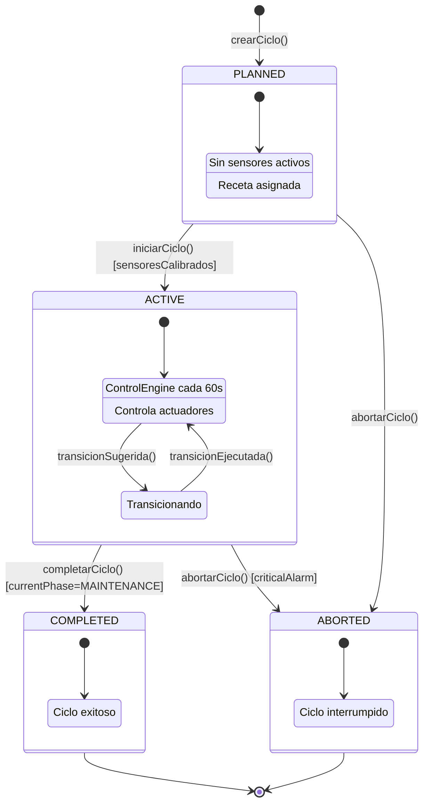
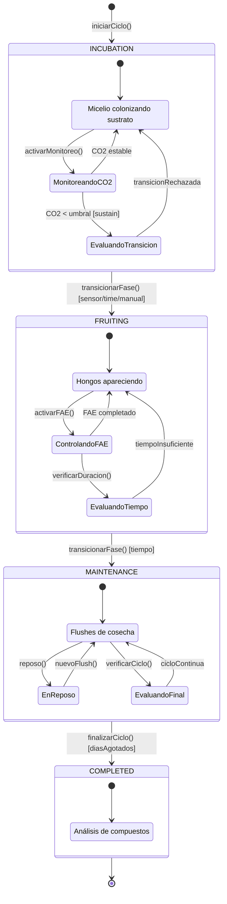
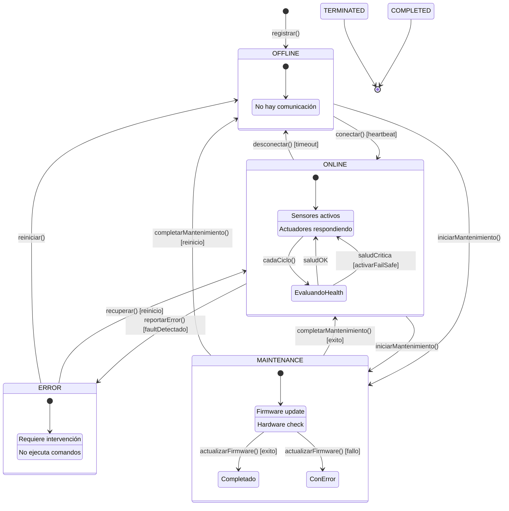
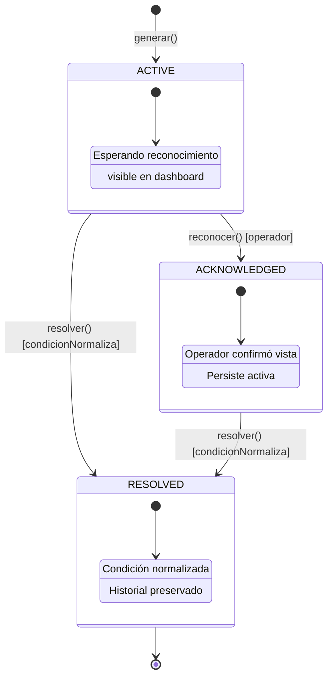
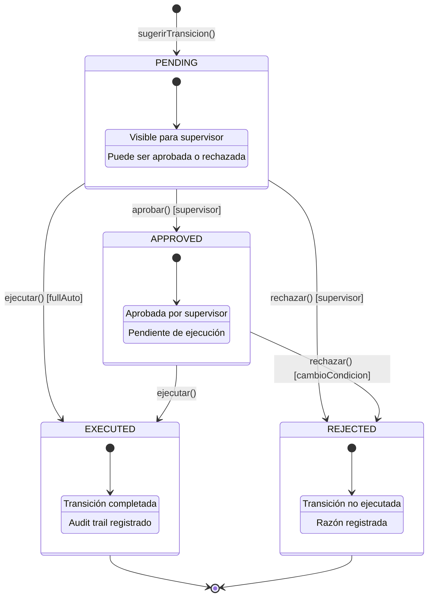
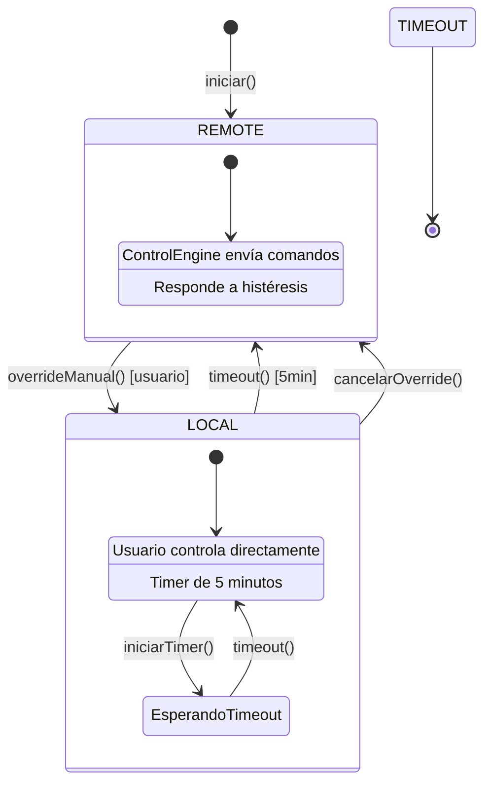
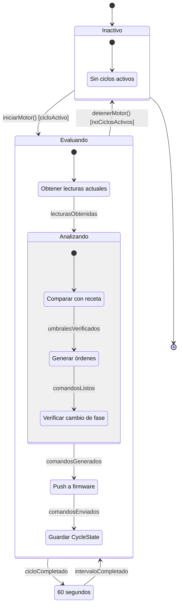

# DDD-005: Máquinas de Estado - Mush2 LabTech

---

## Metadatos

| Campo | Valor |
|-------|-------|
| **ID** | DDD-005 |
| **Nombre** | Máquinas de Estado de Mush2 LabTech |
| **Fecha** | 2026-07-14 |
| **Versión** | 1.0 |
| **Estado** | Borrador |
| **Depende de** | DDD-001, DDD-003 |

---

## 1. Resumen

Las **Máquinas de Estado** modelan el ciclo de vida de las entidades del dominio, definiendo estados válidos, transiciones permitidas y las condiciones que las gobiernan. Este documento especifica todas las máquinas de estado identificadas en Mush2 LabTech.

---

## 2. Convenciones de Notación

### 2.1 Elementos

| Símbolo | Significado |
|---------|-------------|
| `[*]` | Estado inicial |
| `(*)` | Estado final |
| `-->` | Transición |
| `[guarda]` | Condición que debe cumplirse |
| `/acción` | Acción ejecutada en la transición |

### 2.2 Diagramas

Los diagramas usan notación Mermaid `stateDiagram-v2`.

---

## 3. CultivationCycle - Estado del Ciclo

### 3.1 Diagrama



### 3.2 Tabla de Transiciones

| Estado Actual | Evento | Guarda | Estado Nuevo | Acciones |
|---------------|--------|--------|--------------|----------|
| — | crearCiclo() | recetaValida | PLANNED | initPhase=INCUBATION |
| PLANNED | iniciarCiclo() | sensoresCalibrados | ACTIVE | phaseStartedAt=now |
| PLANNED | abortarCiclo() | — | ABORTED | endDate=now |
| ACTIVE | completarCiclo() | currentPhase=MAINTENANCE | COMPLETED | endDate=now |
| ACTIVE | abortarCiclo() | criticalAlarm | ABORTED | endDate=now |
| COMPLETED | — | — | — | Estado final |
| ABORTED | — | — | — | Estado final |

### 3.3 Guardas

| Guarda | Descripción | Implementación |
|--------|-------------|----------------|
| `recetaValida` | recipeId referencia Recipe existente | FK constraint |
| `sensoresCalibrados` | Al menos sensores de temp y hum ACTIVE | Sensor.status=ACTIVE |
| `criticalAlarm` | Existe alarma CRITICAL activa | Alarm.severity=CRITICAL |
| `currentPhase=MAINTENANCE` | Fase actual es MAINTENANCE | CultivationCycle.currentPhase |

### 3.4 Acciones

| Acción | Descripción | Efecto |
|--------|-------------|--------|
| `initPhase` | Inicializa fase | currentPhase=INCUBATION |
| `phaseStartedAt=now` | Registra inicio de fase | phaseStartedAt=new Date() |
| `endDate=now` | Registra fin de ciclo | endDate=new Date() |

---

## 4. Fases del Ciclo (CurrentPhase)

### 4.1 Diagrama



### 4.2 Tabla de Transiciones

| Fase Actual | Evento | Guarda | Fase Nueva | Acciones |
|-------------|--------|--------|------------|----------|
| — | iniciarCiclo() | — | INCUBATION | Registrar inicio |
| INCUBATION | transicionarFase() | sensor/time/manual | FRUITING | PhaseTransition record |
| FRUITING | transicionarFase() | tiempo | MAINTENANCE | PhaseTransition record |
| MAINTENANCE | finalizarCiclo() | diasAgotados | COMPLETED | endDate=now |

### 4.3 Reglas de Transición por Especie

| Especie | Transición | Trigger | Sustain | Notas |
|---------|------------|---------|---------|-------|
| Hericium erinaceus | INCUBATION → FRUITING | CO2 < 800ppm | 60 min | Melena de León |
| Ganoderma lucidum | INCUBATION → FRUITING | CO2 < 700ppm | 120 min | Reishi |
| Lentinula edodes | INCUBATION → FRUITING | Temp < 16°C | 60 min | Shiitake (cold shock) |
| Trametes versicolor | INCUBATION → FRUITING | CO2 < 900ppm | 60 min | Cola de Pavo |
| Cordyceps militaris | INCUBATION → FRUITING | Temp < 22°C | 120 min | Cordyceps |
| Pleurotus ostreatus | INCUBATION → FRUITING | CO2 < 1000ppm | 30 min | Pleurotus |
| Inonotus obliquus | INCUBATION → FRUITING | CO2 < 1200ppm | 120 min | Chaga |

---

## 5. Device - Estado del Dispositivo

### 5.1 Diagrama



### 5.2 Tabla de Transiciones

| Estado Actual | Evento | Guarda | Estado Nuevo | Acciones |
|---------------|--------|--------|--------------|----------|
| — | registrar() | MAC única | OFFLINE | Crear registro |
| OFFLINE | conectar() | heartbeat | ONLINE | lastSeen=now |
| OFFLINE | iniciarMantenimiento() | — | MAINTENANCE | — |
| ONLINE | desconectar() | timeout | OFFLINE | — |
| ONLINE | reportarError() | faultDetectado | ERROR | Registrar fault |
| ONLINE | iniciarMantenimiento() | — | MAINTENANCE | — |
| ONLINE | activarFailSafe() | temp≥32°C | ONLINE | ventilacionON, calorOFF |
| ERROR | recuperar() | reinicio | ONLINE | Limpiar fault |
| ERROR | reiniciar() | — | OFFLINE | — |
| MAINTENANCE | completarMantenimiento() | exito | ONLINE | Actualizar firmware |
| MAINTENANCE | completarMantenimiento() | fallo | OFFLINE | Registrar error |

### 5.3 Guardas

| Guarda | Descripción |
|--------|-------------|
| `heartbeat` | Dispositivo envía heartbeat MQTT |
| `timeout` | No se recibe heartbeat por >5 min |
| `faultDetectado` | Sensor I2C falla o valor inválido |
| `temp≥32°C` | Temperatura crítica alcanzada |
| `exito` | Operación completada sin errores |
| `reinicio` | Dispositivo se reinicia |

### 5.4 Acciones

| Acción | Descripción |
|--------|-------------|
| `lastSeen=now` | Actualiza timestamp de última conexión |
| `ventilacionON` | Activa ventilador (canal 0) |
| `calorOFF` | Desactiva calefactor (canal 1) |
| `Registrar fault` | Guarda tipo de fault en DeviceHealth |

---

## 6. Alarm - Ciclo de Vida

### 6.1 Diagrama



### 6.2 Tabla de Transiciones

| Estado Actual | Evento | Guarda | Estado Nuevo | Acciones |
|---------------|--------|--------|--------------|----------|
| — | generar() | noDuplicado | ACTIVE | Crear registro |
| ACTIVE | reconocer() | operadorVálido | ACKNOWLEDGED | acknowledgedBy=userId |
| ACTIVE | resolver() | condicionNormaliza | RESOLVED | resolvedAt=now |
| ACKNOWLEDGED | resolver() | condicionNormaliza | RESOLVED | resolvedAt=now |
| RESOLVED | — | — | — | Estado final |

### 6.3 Deduplicación

```javascript
async function ensureAlarm(deviceId, type, sensorType, severity, message) {
  // Verificar si ya existe alarma activa
  const existing = await Alarm.findOne({
    where: { deviceId, type, sensorType, resolvedAt: null }
  });
  
  if (existing) return existing; // Deduplicación
  
  // Crear nueva alarma
  return await Alarm.create({
    deviceId, type, sensorType, severity, message
  });
}
```

### 6.4 Resolución Automática

```javascript
async function resolveAlarm(deviceId, type, sensorType) {
  const active = await Alarm.findOne({
    where: { deviceId, type, sensorType, resolvedAt: null }
  });
  
  if (active) {
    await active.update({ resolvedAt: new Date() });
    events.emit('alarm', { ...active.toJSON(), action: 'RESOLVED' });
  }
}
```

---

## 7. PhaseTransition - Workflow de Aprobación

### 7.1 Diagrama



### 7.2 Tabla de Transiciones

| Estado Actual | Evento | Guarda | Estado Nuevo | Acciones |
|---------------|--------|--------|--------------|----------|
| — | sugerirTransicion() | modoSEMI_AUTO | PENDING | Crear registro |
| PENDING | aprobar() | supervisorVálido | APPROVED | approvedBy=userId |
| PENDING | rechazar() | supervisorVálido | REJECTED | notes=razón |
| PENDING | ejecutar() | modoFULL_AUTO | EXECUTED | actualizarFase |
| APPROVED | ejecutar() | — | EXECUTED | actualizarFase |
| APPROVED | rechazar() | cambioCondicion | REJECTED | notes=razón |
| EXECUTED | — | — | — | Estado final |
| REJECTED | — | — | — | Estado final |

### 7.3 Modos de Operación

| Modo | Comportamiento |
|------|----------------|
| **MANUAL** | Sin transiciones automáticas |
| **SEMI_AUTO** | Crea PhaseTransition con status=PENDING, espera aprobación |
| **FULL_AUTO** | Crea PhaseTransition con status=EXECUTED directamente |

---

## 8. Actuator - Modo de Operación

### 8.1 Diagrama



### 8.2 Tabla de Transiciones

| Estado Actual | Evento | Guarda | Estado Nuevo | Acciones |
|---------------|--------|--------|--------------|----------|
| — | iniciar() | — | REMOTE | Modo por defecto |
| REMOTE | overrideManual() | usuarioAutorizado | LOCAL | overrideUntil=now+5min |
| LOCAL | timeout() | 5min transcurridos | REMOTE | Restaurar control |
| LOCAL | cancelarOverride() | — | REMOTE | Restaurar control inmediato |

### 8.3 Lógica de Override

```javascript
async function overrideManual(deviceId, channel, userId) {
  const actuator = await Actuator.findOne({ where: { deviceId, channel } });
  
  if (!actuator) throw new Error('Actuator not found');
  if (actuator.mode === 'LOCAL') throw new Error('Already in LOCAL mode');
  
  const overrideUntil = new Date(Date.now() + 5 * 60 * 1000); // 5 minutos
  
  await actuator.update({
    mode: 'LOCAL',
    overrideUntil
  });
  
  // Programar restauración automática
  setTimeout(async () => {
    await actuator.update({ mode: 'REMOTE', overrideUntil: null });
    events.emit('state', { deviceId, channel, mode: 'REMOTE' });
  }, 5 * 60 * 1000);
}
```

---

## 9. ControlEngine - Ciclo de Evaluación

### 9.1 Diagrama



### 9.2 Flujo del Ciclo

```
1. LEER SENSORES
   └─> Obtener últimas lecturas de Telemetry
   
2. ANALIZAR
   ├─> Verificar umbrales vs receta activa
   ├─> Calcular desviaciones
   └─> Determinar severidad de alarmas
   
3. COMPUTAR COMANDOS
   ├─> Aplicar histéresis (±1.0°C)
   ├─> Verificar fail-safe (temp ≥ 32°C)
   └─> Generar órdenes para actuadores
   
4. ENVIAR COMANDOS
   └─> Push vía MQTT/WebSocket
   
5. REGISTRAR ESTADO
   └─> Crear CycleState snapshot
   
6. EVALUAR TRANSICIÓN
   └─> Verificar si se debe cambiar de fase
```

### 9.3 Fail-Safe

```javascript
function computeCommands(readings, recipe, phase) {
  const temp = readings.temperature;
  const state = getActuatorState(deviceId);
  
  // FAIL-SAFE: Temperatura crítica
  if (temp >= 32.0) {
    return {
      ventOn: true,    // FORZAR ventilación
      heatOn: false,   // FORZAR calefacción OFF
      humidOn: false,  // FORZAR humidificador OFF
      overheat: true
    };
  }
  
  // ... lógica normal de control
}
```

---

## 10. Resumen de Máquinas de Estado

| Máquina | Estados | Transiciones | Guardas Principales |
|---------|---------|--------------|---------------------|
| **CultivationCycle** | 4 (PLANNED, ACTIVE, COMPLETED, ABORTED) | 5 | sensoresCalibrados, criticalAlarm |
| **CurrentPhase** | 4 (INCUBATION, FRUITING, MAINTENANCE, COMPLETED) | 4 | sensor/time/manual |
| **Device** | 4 (ONLINE, OFFLINE, MAINTENANCE, ERROR) | 9 | heartbeat, timeout, fault |
| **Alarm** | 3 (ACTIVE, ACKNOWLEDGED, RESOLVED) | 4 | operador, condicionNormaliza |
| **PhaseTransition** | 4 (PENDING, APPROVED, EXECUTED, REJECTED) | 6 | supervisor, modo |
| **Actuator** | 2 (REMOTE, LOCAL) | 3 | usuario, timeout |
| **ControlEngine** | 2 (Evaluando, Inactivo) | 3 | cicloActivo, intervalo |

---

## 11. Historial de Cambios

| Versión | Fecha | Autor | Cambios |
|---------|-------|-------|---------|
| 1.0 | 2026-07-14 | Equipo Mush2 | Creación del documento |

---

*Documento generado como parte del proceso de Domain-Driven Design de Mush2 LabTech.*
